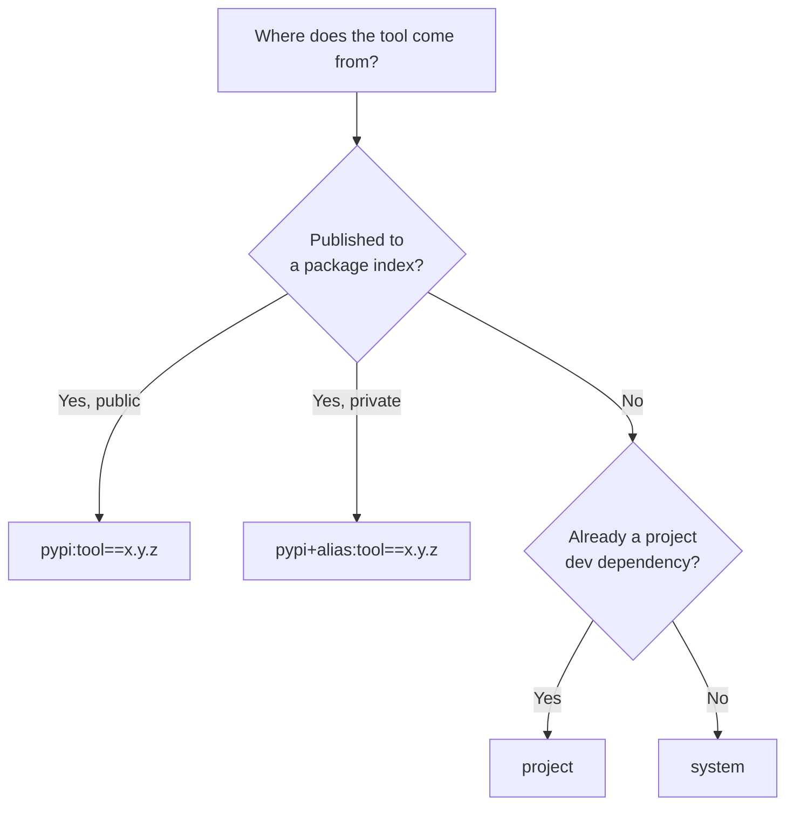

# Source Types

A hook's `from` field says where its tool comes from. This is the main thing hooksmith
does differently from pre-commit: a source is a **package**, not a git repository to
clone and hope about.

| `from` | Tool comes from | Environment built? |
|---|---|---|
| `pypi:<requirement>` | A package index | Yes — a cached, isolated venv |
| `pypi+<alias>:<requirement>` | A named private index | Yes |
| `project` | Your project's own venv | No — reuses what's there |
| `system` | Whatever is on `PATH` | No |

---

## `pypi:` — a pinned package

```toml
[[hook]]
id   = "ruff"
from = "pypi:ruff==0.4.9"
run  = "ruff check {files}"
```

The requirement is a standard [PEP 440](https://peps.python.org/pep-0440/) specifier,
so ranges work:

```toml
from = "pypi:ruff>=0.4,<1"     # highest release satisfying the range
from = "pypi:ruff"             # latest release
from = "pypi:ruff==0.4.9"      # exactly this
```

hooksmith resolves the requirement against the index, builds an isolated venv with
`uv`, and caches it. The cache is content-addressed on
`(package, version, index URL)` — so ten hooks (or ten packages in a monorepo)
pinning `ruff==0.4.9` share **one** venv.

!!! tip "Pin exactly"

    An exact pin (`==`) is reproducible, makes the cache key stable, and is the only
    form [offline mode](../guides/air-gapped.md) can resolve without the index. A
    range means a new release silently changes what runs.

Markers and extras (`ruff; sys_platform == "linux"`, `black[d]`) are not supported and
are rejected at resolution with a clear message.

---

## `pypi+<alias>:` — a private index

Declare the alias once, then reference it:

```toml
[sources]
default-registry = "https://pypi.org/simple"

[sources.extra-registries]
internal = "https://pkgs.corp.example.com/simple"
```

```toml
[[hook]]
id   = "house-style"
from = "pypi+internal:house-style==2.1.0"
run  = "house-style {files}"
```

The index URL is part of the cache key, so the same package name from two different
indexes never collides. See [Private Registries](../guides/private-registries.md) for
authentication and mirrors.

Index URLs must be `http`/`https`. A `file://` or other scheme is rejected before any
request is made.

---

## `project` — a tool already in your venv

```toml
[[hook]]
id         = "mypy"
from       = "project"
run        = "mypy src/"
pass-files = false
```

Nothing is installed or cached. hooksmith looks for the tool in:

1. `$VIRTUAL_ENV/bin` (or `Scripts\` on Windows), if a venv is active
2. `<workspace root>/.venv/bin`

Use this when the tool is already a development dependency and you want exactly the
version your project pins — `mypy` is the usual case, because it needs to see your
installed packages to type-check against them.

If the tool isn't there you get a clear error naming both places it looked.

---

## `system` — whatever is on `PATH`

```toml
[[hook]]
id         = "cargo-clippy"
from       = "system"
run        = "cargo clippy -- -D warnings"
pass-files = false
```

Resolved with a `PATH` lookup. No environment management at all.

This is the right choice for non-Python tools your image or machine already provides —
`cargo`, `shellcheck`, `prettier`, `make` — and for anything hooksmith can't install
for you. The trade-off is that reproducibility becomes your responsibility: the
version is whatever the machine has.

---

## Not supported yet: `local:`, `git:`, `docker:`

These three schemes are **recognized but not implemented**. A config using them loads
without a syntax error, and resolving one fails with:

```
cannot resolve environment for hook 'x': 'docker' sources are not supported
```

They're reserved deliberately, so the error is clear rather than a confusing parse
failure. Today:

- Instead of `local:` — use `system` with a relative command (`run = "./scripts/lint.sh {files}"`).
- Instead of `git:` — publish to an index (including a private one) and use `pypi:`.
- Instead of `docker:` — run the container yourself via `system`
  (`run = "docker run --rm -v $PWD:/src linter {files}"`).

---

## Choosing



Rule of thumb: **`pypi:` when you can, `project` when the tool must see your
dependencies, `system` for everything else.**

## See also

- [check.toml Reference](reference.md) — every hook field.
- [`hooksmith sync`](../cli/sync.md) — build the environments ahead of time.
- [`hooksmith cache why`](../cli/cache.md) — see the resolved version and cache key.
