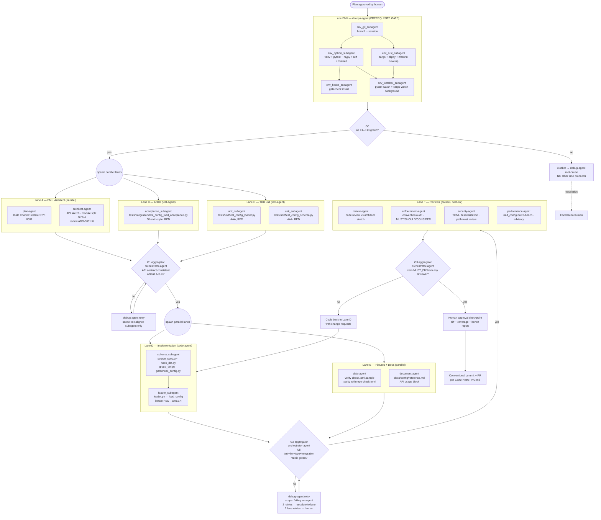

# BUILD-0001: Multiagent Build Plan for STY-0001 (Config Loader)

> **Status: DRAFT — NO LANE BEGINS EXECUTION UNTIL APPROVED.**
> This document satisfies Step 6 of the requested Multiagent Implementation
> protocol. Per the user constraint: *"No agent or subagent begins work until
> I explicitly approve this plan."*

---

## 0. Target of this build

The most concrete piece of work the planning tree has acceptance criteria for
is **[STY-0001 — Load `check.toml` into a validated model](../features/FEAT-0001-config-loader/stories/STY-0001-load-check-toml.md)**.
Every lane below targets it. The current state on `main`:

| Artifact | State |
|---|---|
| [src/gatecheck/config/schema.py](../../src/gatecheck/config/schema.py) | Stub — empty pydantic classes |
| [src/gatecheck/config/loader.py](../../src/gatecheck/config/loader.py) | Stub — `raise NotImplementedError` |
| [src/gatecheck/config/__init__.py](../../src/gatecheck/config/__init__.py) | Re-exports the stubs |
| [tests/unit/test_config_loader.py](../../tests/unit/test_config_loader.py) | 286 B placeholder |
| [tests/fixtures/check.toml.sample](../../tests/fixtures/check.toml.sample) | 339 B sample (present) |
| `docs/config/reference.md` | Needs a usage section |

Per Step 5 ("No stubs, no placeholders, no deferred implementation"), the
existing `NotImplementedError`-style stubs are **the artifact this build
replaces**. They are explicitly disallowed in the delivered output.

---

## 1. Conventions Loaded

### 1.1 Loaded and applied

| Convention | Location | Applies to |
|---|---|---|
| Repo planning hierarchy | [planning/README.md](../README.md) | All planning artifacts (PRD→ADR→FEAT→STY→TSK; 4-digit zero-padded IDs; immutable ADRs; upward links). |
| Project routing & agent registry | [CLAUDE.md](../../CLAUDE.md) | Agent selection. Lists 24 primary agents and 14 routing keyword groups. |
| Startup / session protocol | [.claude/conventions/core/general.md](../../.claude/conventions/core/general.md) | Mandatory branch + session file checks. **Currently violated — we are on `main` with no session file.** See §9. |
| Trunk-based dev + Conventional Commits | [CONTRIBUTING.md](../../CONTRIBUTING.md) | Branch naming (`feature/<slug>`, `fix/<slug>`, …), commit format, squash/rebase merges, CI-computed versioning. |
| Repo manifest | [.prompticorn/.prompticorn.yaml](../../.prompticorn/.prompticorn.yaml) | Authoritative toolchain (Python 3.14 / uv / ruff / pytest / pytest-cov / mutmut / mypy via hybrid; Rust 1.75 / cargo / clippy / rustfmt). Coverage targets: line ≥ 80 %, branch ≥ 70 %, function ≥ 90 %, statement ≥ 85 %, mutation ≥ 80 %, path ≥ 60 %. |
| Python language conventions | [.claude/conventions/languages/python.md](../../.claude/conventions/languages/python.md) | No module-level constants, no `getattr/setattr` outside framework code, no nested defs, no import-forwarding in `__init__.py`, one class per file (filename = `snake_case(ClassName)`), interface-style abstract classes, properties over getters/setters, mandatory type hints, pyright/mypy strict, SOLID. |
| Rust language conventions | [.claude/conventions/languages/rust.md](../../.claude/conventions/languages/rust.md) | `Result<T,E>` + `thiserror`/`anyhow`, no panic in library code, prefer borrowing, traits-for-abstraction. (Not exercised by STY-0001 but loaded for the env lane.) |
| Workflow shape | [.claude/workflows/feature.md](../../.claude/workflows/feature.md) | Plan → Confirm → Implement → Follow-up. Embedded into Lane sequencing below. |
| Subagent specs | [.claude/subagents/feature.md](../../.claude/subagents/feature.md), `boilerplate.md`, `house-style.md`, `pr-description.md` | Loaded on-demand by parent agents. |
| Skill specs | `.claude/skills/{feature-planning,incremental-implementation,test-aaa-structure,test-coverage-categories,test-mocking-rules,post-implementation-checklist}/SKILL.md` | Loaded on-demand at the named workflow steps. |
| PRD / ADR / Feature / Story | [PRD-0001](../prd/0001-gatecheck.md), [ADR-0001](../adr/0001-python-host-rust-core.md), [FEAT-0001](../features/FEAT-0001-config-loader/feature.md), [STY-0001](../features/FEAT-0001-config-loader/stories/STY-0001-load-check-toml.md) | Goal, scope, acceptance, non-goals. |
| Project lint config | [check.toml](../../check.toml) | Self-hosting hook set: ruff, ruff-format, mypy, cargo-fmt-check, cargo-clippy, detect-secrets (CI-only), commitizen. |
| Python build manifest | [pyproject.toml](../../pyproject.toml) | `requires-python = ">=3.11"`, deps incl. `pydantic>=2`, `click>=8.1`, `rich>=13`. Dev: `pytest>=8`, `pytest-cov>=5`, `pytest-xdist>=3`, `mypy>=1.10`, `ruff>=0.4`, `maturin>=1.5`. **No `tomli` — relies on stdlib `tomllib` (3.11+).** |

### 1.2 Gaps / conflicts found (must be resolved before Lane execution)

The enforcement-agent cannot enforce what is not defined. Each item below
blocks the relevant lane, not the whole plan.

| # | Conflict / gap | Blocks | Proposed resolution |
|---|---|---|---|
| C1 | **Branch naming conflict.** `general.md` mandates `feat/PROJ-123-<slug>` (Jira-style ticket IDs). `CONTRIBUTING.md` mandates `feature/<short-description>` (no tickets — gatecheck tracks via in-repo `FEAT-NNNN`). The two cannot both be followed. | Branch creation, enforcement-agent. | Pick **CONTRIBUTING.md** as authoritative (it lives in the repo root and matches the planning ID system). Mark `general.md`'s branch section as superseded for this repo. |
| C2 | **Python version drift.** `pyproject.toml`: `>=3.11`. `.prompticorn.yaml`: `3.14`. STY-0001 says "use `tomllib` (stdlib, 3.11+)". | Env lane (Python pin), CI matrix. | Build against the floor (3.11) and pin uv-managed venv to 3.11 for the env lane to match what users will install with. Treat 3.14 in the yaml as the dev-machine target, not a hard pin. |
| C3 | **`__init__.py` import-forwarding.** `python.md`: "**NEVER use import forwarding**". Existing [src/gatecheck/config/__init__.py](../../src/gatecheck/config/__init__.py) re-exports `load_config`, `GatecheckConfig`, etc. This is the documented public API in STY-0001. | Enforcement gate (would FAIL), API contract (would BREAK). | Two-path decision needed: **(a)** carve a documented exception for top-level package facade modules (recommended, matches stdlib convention and STY-0001's stated import path `from gatecheck.config import load_config`), or **(b)** rewrite the convention. Recording as a needed clarification, not silently bypassing. |
| C4 | **One-class-per-file rule vs schema cohesion.** `python.md`: "One class per file… filename must be the snake_case version of the class name." STY-0001 TSK-001 places four pydantic classes in one `schema.py`. | code-agent's schema_subagent. | Split into `src/gatecheck/config/source_spec.py`, `hook_def.py`, `group_def.py`, `gatecheck_config.py`. Keep `schema.py` only if approved as a barrel — but per the same convention, barrels are `__init__.py`-only. Recommendation: split. |
| C5 | **Templated convention files unrendered.** `general.md`, `python.md`, `rust.md` contain literal Jinja (`{{ language }}`, ``) and `[Dynamic content - see template]` / `TODO` blocks in critical sections (Testing, Error Handling pattern, Repository Structure, Database, Commit style, PR size limit, Deployment). | All lanes — enforcement has nothing to enforce in those sections. | Use the **rendered values** from `.prompticorn.yaml` and `pyproject.toml` as the de-facto truth. Flag the unrendered files for a separate `chore` PR to materialize them; do not block STY-0001 on it. |
| C6 | **`.claude/subagents/strategy.md` referenced but not present at the time of inspection.** `test-agent.md` lists `strategy` as its only subagent. | test-agent's delegation pattern. | Use the test skills (`test-aaa-structure`, `test-coverage-categories`, `test-mocking-rules`, `test-aaa-structure`) directly instead of the missing subagent. |
| C7 | **No specified ATDD framework.** STY-0001 lists only `pytest`. Acceptance-level tests in `tests/integration/` use plain `pytest`. | ATDD lane. | Treat `pytest` files under `tests/integration/` as acceptance tests; use Gherkin-style docstrings (`Given/When/Then`) without adding `pytest-bdd`. No new dependency, no scope creep. |
| C8 | **No real network/registry integration in scope for STY-0001.** Step 5 demands end-to-end integration verification at every system boundary. STY-0001's *only* boundary is the local filesystem reading `check.toml`. | Integration-verification plan. | Treat the filesystem read + a fully-realized parse-and-validate against the **repo's own `check.toml`** as the end-to-end integration. No mocks at this boundary. See §8. |
| C9 | **Currently on `main` with no session file.** `general.md` is unambiguous: STOP and branch before any work. The plan document itself is work. | Hard stop on everything. | Approve creation of `feature/sty-0001-config-loader` and a session file under `.prompticorn/sessions/` as the **first action of the env lane**. See §9. |

---

## 2. Discovered Agent Roster

All 24 primary agents from [CLAUDE.md](../../CLAUDE.md). Roles assigned per
the multiagent protocol's Step 2 (PM/architect, code, ATDD, TDD, verify,
enforce, security, debug).

| Agent | Pipeline role | Used in this build? |
|---|---|---|
| plan-agent | **PM** — restate goal, build charter. | ✓ Lane A |
| architect-agent | **Architect** — confirm ADR-0001 fit, sketch API surface & module layout. | ✓ Lane A |
| product-agent | PM partner — out of scope (PRD is settled). | — |
| code-agent | **Code** — schema + loader implementation. Spawns 2 subagents. | ✓ Lane D |
| test-agent | **ATDD + TDD** — spawns acceptance and unit subagents in parallel. | ✓ Lanes B & C |
| review-agent | **Verify** — code review against architect sketch and conventions. | ✓ Lane F |
| enforcement-agent | **Enforce** — coding-standard audit, change requests if violated. | ✓ Lane F |
| security-agent | **Security** — input-trust review (TOML parse on user-controlled file). | ✓ Lane F |
| debug-agent | **Debug & retry owner** — owns retry loop and root-cause if any lane fails. | ✓ Standby, escalation §10 |
| performance-agent | Performance — micro-bench `load_config()` cold call. Advisory only (PRD's <10 ms target is CLI cold start, not loader). | ✓ Lane F (advisory) |
| document-agent | Docs — `docs/config/reference.md` usage block (TSK-005). | ✓ Lane E |
| data-agent | Fixtures — `tests/fixtures/check.toml.sample` already exists; verify parity with repo `check.toml` (TSK-003). | ✓ Lane E |
| devops-agent | **Env owner** — spawns env subagents and watcher subagents. | ✓ Lane ENV |
| orchestrator-agent | **Aggregator** — owns gates G1/G2/G3 and lane sequencing. Updates session file. | ✓ All gates |
| refactor-agent | Out of scope (STY-0001 is greenfield for the loader). | — |
| migration-agent | Out of scope. | — |
| backend-agent | Out of scope (no API/service surface in STY-0001). | — |
| frontend-agent | Not applicable (CLI). | — |
| compliance-agent | Not applicable (no PII / regulated data). | — |
| observability-agent | Not applicable (no runtime telemetry surface added). | — |
| incident-agent | Not applicable. | — |
| mlai-agent | Not applicable. | — |
| ask-agent | Not applicable. | — |
| explain-agent | Out of scope (no onboarding artifact requested). | — |

**Role coverage check:** PM ✓, Architect ✓, Code ✓, ATDD ✓, TDD ✓, Verify ✓,
Enforce ✓, Security ✓, Debug ✓. No role with no matching agent.

---

## 3. Environment Manifest

Every service / process started by the **env lane (devops-agent)** before
any other lane is unblocked. Started, not assumed.

| # | Service / process | Purpose | Owner subagent | Health check | Stop command |
|---|---|---|---|---|---|
| E1 | `git` repo state | Branch + session file are mandatory infrastructure. | env_git_subagent | `git branch --show-current` matches `feature/sty-0001-config-loader`; session file present in `.prompticorn/sessions/`. | (no stop — persistent state) |
| E2 | Python 3.11 toolchain | Floor version per `pyproject.toml`; `tomllib` is stdlib. | env_python_subagent | `uv python list \| grep 3.11`; install if missing. | (no stop) |
| E3 | Project venv (`.venv`) | Isolated env for editable install + dev deps. | env_python_subagent | `uv venv .venv --python 3.11 && uv pip install -e ".[dev]"`; `.venv/bin/python -c "import gatecheck"` exits 0. | `rm -rf .venv` |
| E4 | `pytest` + `pytest-cov` + `pytest-xdist` resolved | Test runner. | env_python_subagent | `.venv/bin/pytest --version` and `pytest --collect-only tests/` lists existing placeholders. | (no stop) |
| E5 | `mypy` strict-mode resolved | Static type gate (acceptance criterion). | env_python_subagent | `.venv/bin/mypy --version`; `mypy --strict src/gatecheck/config/` runs (currently passes against the stubs). | (no stop) |
| E6 | `ruff` (lint + format) | Style gate. | env_python_subagent | `.venv/bin/ruff check src/ tests/` and `ruff format --check src/ tests/` run. | (no stop) |
| E7 | `mutmut` available | Mutation-testing gate (per `.prompticorn.yaml` 80 % target). | env_python_subagent | `.venv/bin/mutmut --help` returns 0. | (no stop) |
| E8 | Rust 1.75+ + `cargo` + `clippy` + `rustfmt` | Required by check.toml hook set (`cargo-fmt-check`, `cargo-clippy`); STY-0001 doesn't touch Rust but the env lane verifies it because it's a downstream prerequisite. | env_rust_subagent | `cargo --version`, `cargo clippy --version`, `cargo fmt --version`. `cargo check --manifest-path gatecheck-rs/Cargo.toml` exits 0. | (no stop) |
| E9 | `maturin develop --release` (gatecheck-core) | Required so `from gatecheck import …` resolves the Rust wheel symbol set referenced in pyproject deps (`gatecheck-core>=0.1.0`). STY-0001 acceptance says "no runtime dependency on the Rust core", so the loader must not transitively import it — but the venv still needs to satisfy the wheel. | env_rust_subagent | `.venv/bin/python -c "import gatecheck_core; print(gatecheck_core.__file__)"` exits 0. | `rm .venv/lib/python3.11/site-packages/gatecheck_core*` |
| E10 | `pytest --looponfail` watcher (background) | Re-run unit tests on file save during Lane D. | env_watcher_subagent | Background PID file `.prompticorn/run/pytest-watch.pid`; tail `.prompticorn/run/pytest-watch.log` shows passing collection. | `kill $(cat .prompticorn/run/pytest-watch.pid)` |
| E11 | `cargo watch -x check` (background) | Catches accidental Rust breakage during the build. | env_watcher_subagent | Background PID file `.prompticorn/run/cargo-watch.pid`; log shows `cargo-watch: ready`. | `kill $(cat .prompticorn/run/cargo-watch.pid)` |
| E12 | `gatecheck install` (this project's own pre-commit hooks) | Self-hosting check from check.toml — guarantees committed code passes the same hooks CI will. | env_hooks_subagent | `cat .git/hooks/pre-commit` includes `gatecheck`; `gatecheck run lint` against an empty staged set exits 0. | `git config --unset-all core.hooksPath`; or `gatecheck uninstall` once implemented. |
| E13 | `.prompticorn/sessions/session_20260528_<rand>.md` | Mandatory per `general.md`. Tracks mode history, actions, context summary across all lanes. | env_git_subagent | File exists, frontmatter `branch:` matches current branch, all six required sections present. | (no stop) |

**Dependency graph for env lane:** E1 → E13 (need branch before session); E2
→ E3 → {E4, E5, E6, E7, E9, E12}; E8 → E11; E3 → E10. All independent
subgraphs run concurrently. Lane gate G0 is "every health check above
returns green".

**Hard rule:** If E1–E13 cannot all reach green, the env lane raises a
blocker and **no other lane is unblocked**. Specifically, if Rust toolchain
or `gatecheck-core` wheel is missing on this machine, the env lane reports
that as a Gap §9 item — it does **not** ask the human to run a command.
The env lane itself runs `rustup` / `maturin develop`.

---

## 4. Execution Map



---

## 5. Subagent Specification

Each subagent is spawned by exactly one parent agent. Inputs, outputs, and
convention constraints are explicit so every subagent is independently
schedulable.

### 5.1 ENV lane subagents (parent: devops-agent)

| Subagent | Parent | Scope | Inputs | Outputs | Conventions |
|---|---|---|---|---|---|
| env_git_subagent | devops-agent | Create branch + session file (E1, E13). | Current branch, `.prompticorn.yaml`, `general.md`, `CONTRIBUTING.md`. | Branch `feature/sty-0001-config-loader` (per C1 resolution); session file with frontmatter. | CONTRIBUTING.md branch naming; general.md session schema. |
| env_python_subagent | devops-agent | E2–E7. | `pyproject.toml`, `.prompticorn.yaml`. | `.venv/`, dev deps resolved, health-check report. | python.md (uv as package manager). |
| env_rust_subagent | devops-agent | E8, E9. | `gatecheck-rs/Cargo.toml`, `gatecheck-rs/pyproject.toml`. | `cargo check` green, `gatecheck_core` importable. | rust.md. |
| env_hooks_subagent | devops-agent | E12. | `check.toml`. | `.git/hooks/pre-commit` installed. | This repo's own check.toml. |
| env_watcher_subagent | devops-agent | E10, E11 background processes. | `tests/`, `src/`, `gatecheck-rs/src/`. | PID files + tailable logs under `.prompticorn/run/`. | general.md (file locations). |

### 5.2 Lane A subagents (parent: orchestrator-agent — direct delegation, no subagents spawned)

Lane A's two agents (`plan-agent`, `architect-agent`) operate directly. No
fan-out is necessary.

| Agent | Inputs | Outputs | Conventions |
|---|---|---|---|
| plan-agent | PRD-0001, FEAT-0001, STY-0001. | `planning/build-plans/0001-charter.md` (1 page): restated goal, in/out of scope, success criteria. | planning/README.md doc style. |
| architect-agent | ADR-0001, PRD-0001, [docs/config/reference.md](../../docs/config/reference.md), current stubs in `src/gatecheck/config/`. | API sketch (file paths, public symbols, type signatures) committed to `planning/build-plans/0001-architecture-sketch.md`. **Locks the contract Lanes B/C/D consume.** | python.md (one-class-per-file; resolution to C4); ADR-0001. |

### 5.3 Lane B subagents (parent: test-agent)

| Subagent | Scope | Inputs | Outputs | Conventions |
|---|---|---|---|---|
| acceptance_subagent | Write acceptance tests that mirror STY-0001's 4 acceptance bullets. | architect sketch (5.2); STY-0001; `check.toml`. | `tests/integration/test_config_load_acceptance.py` containing: (i) load real repo `check.toml` parses to non-empty `GatecheckConfig`; (ii) `mypy --strict` shell-out passes; (iii) `pytest --cov` reports ≥ 90 % line coverage on `gatecheck.config`; (iv) no import of `gatecheck_core` from `gatecheck.config`. All tests must **fail red** until Lane D delivers. | skills `test-aaa-structure`, `test-coverage-categories`. Gherkin-style docstrings (resolution C7). |

### 5.4 Lane C subagents (parent: test-agent, spawned in parallel)

| Subagent | Scope | Inputs | Outputs | Conventions |
|---|---|---|---|---|
| unit_subagent_loader | Unit-level red tests for `load_config`. | architect sketch, STY-0001 TSK-004. | `tests/unit/test_config_loader.py`: happy-path with sample; missing required key raises; unknown key raises; idempotent re-load; round-trip vs `tomllib.loads`. | `test-aaa-structure`, `test-mocking-rules` (filesystem allowed; no mocks). |
| unit_subagent_schema | Unit-level red tests for pydantic models. | architect sketch. | `tests/unit/test_config_schema.py`: each model rejects wrong types, accepts minimal valid input, exposes `.model_dump()`. | `test-aaa-structure`. |

### 5.5 Lane D subagents (parent: code-agent, spawned sequentially because D2 depends on D1)

| Subagent | Scope | Inputs | Outputs | Conventions |
|---|---|---|---|---|
| schema_subagent | Implement four pydantic models, one per file. | architect sketch; TSK-001. | `src/gatecheck/config/source_spec.py`, `hook_def.py`, `group_def.py`, `gatecheck_config.py`. No `pass`, no `TODO`, no `NotImplementedError`. | python.md (one class per file = C4 resolution; no module constants → use pydantic field defaults; no `setattr/getattr`). |
| loader_subagent | Implement `load_config`. | architect sketch; TSK-002; schema_subagent output. | `src/gatecheck/config/loader.py` using stdlib `tomllib` + pydantic. Synchronous. Side-effect free per STY-0001 Notes. | python.md (type hints mandatory; no nested defs; absolute imports). |

**`__init__.py` handling.** Per C3, the existing facade `from gatecheck.config import load_config` is preserved as the documented public API. The python.md "no import forwarding" rule is treated as not applicable to top-level package facade modules; this exception is recorded in the architecture sketch for enforcement-agent to honour.

### 5.6 Lane E subagents

| Subagent | Parent | Scope | Inputs | Outputs | Conventions |
|---|---|---|---|---|---|
| fixture_subagent | data-agent | Verify `tests/fixtures/check.toml.sample` covers every section/key shape the schema validates; expand if gaps. | Existing fixture; architect sketch. | Updated `check.toml.sample` (or confirmation that current is sufficient). | TSK-003. |
| docs_subagent | document-agent | Write the usage section in `docs/config/reference.md`. | `gatecheck.config` public API; STY-0001 TSK-005. | New "Python API" section with a runnable snippet. | mkdocs Material conventions (existing site uses it). |

### 5.7 Lane F subagents (parent: orchestrator-agent — direct, no further fan-out)

Each lane-F agent runs as a single concurrent subagent against the
delivered diff. They produce machine-checkable verdicts that gate G3.

---

## 6. Convention Enforcement (per agent, per gate)

A convention is only enforced where it's actually checkable. This table
makes the "what is checked, where, by whom" mapping explicit.

| Convention | Applied by | Checked at |
|---|---|---|
| Branch name (`feature/sty-0001-config-loader`) per C1 | env_git_subagent | G0 |
| Session file mandatory (frontmatter + 6 sections) | env_git_subagent | G0 |
| Python 3.11 floor; uv-managed venv | env_python_subagent | G0 |
| `pyproject.toml` is the only place adding deps (STY-0001 acceptance) | enforcement-agent | G3 |
| One class per file (resolution C4) | code-agent (schema_subagent) self-check; enforcement-agent | G2 (compile/import), G3 (audit) |
| No module-level constants; no nested defs; no `setattr/getattr` | enforcement-agent | G3 |
| Mandatory type hints; `mypy --strict src/gatecheck/config/` exits 0 | code-agent self-check; G2 aggregator runs mypy | G2 |
| Absolute imports only; stdlib → 3rd-party → local grouping | enforcement-agent (ruff isort ruleset) | G2 (ruff), G3 (audit) |
| No silent error swallowing; pydantic `ValidationError` surfaces upward | review-agent | G3 |
| AAA pattern; tests independent; no shared mutable fixtures | test-agent self-check via skill `test-aaa-structure` | G1 |
| Mocking only at true boundaries (`test-mocking-rules`) — none here since the only boundary is the filesystem and we use real files | test-agent self-check | G1 |
| Coverage gates (line ≥ 80 %, branch ≥ 70 %, function ≥ 90 %, statement ≥ 85 %, mutation ≥ 80 %) per `.prompticorn.yaml` | G2 aggregator runs `pytest --cov` and `mutmut run --paths-to-mutate=src/gatecheck/config/` | G2 |
| Conventional Commits; squash/rebase merge | orchestrator-agent at commit step | After Human2 |
| Pre-commit hooks (ruff, ruff-format, cargo-fmt-check, cargo-clippy) pass before commit | E12 hook chain | G2 (during runs), commit-time |

---

## 7. Test Strategy

Following the requested ATDD-before-coding, TDD-in-parallel pattern.

### 7.1 ATDD (Lane B, before Lane D starts)

Acceptance tests are written first against the architect's locked API
sketch and **must be RED** before Lane D begins. They mirror STY-0001's
four bullets and live at `tests/integration/test_config_load_acceptance.py`.

Each test uses an explicit `Given / When / Then` docstring per C7 — no new
framework added.

```
test_load_repo_check_toml_returns_non_empty_config()
test_mypy_strict_passes_on_config_package()
test_config_package_does_not_import_gatecheck_core()
test_coverage_on_config_package_at_least_ninety_percent()
```

The last one is implemented by invoking `pytest --cov` against the unit
tests in a subprocess and parsing the coverage report — the integration
test is the acceptance witness that the unit test suite produced the
required coverage.

### 7.2 TDD (Lane C, concurrent with Lane B)

Unit tests (`tests/unit/test_config_loader.py`, `…/test_config_schema.py`)
are written by `unit_subagent_loader` and `unit_subagent_schema`
**concurrently with** the acceptance tests in Lane B. Both Lane B and
Lane C must complete and merge their RED tests before G1 unblocks Lane D.

This satisfies the user requirement: *"TDD tests written in parallel with
coding by a concurrent subagent"* — but with a stronger guarantee, since
the tests precede coding entirely (red-green-refactor).

### 7.3 Test patterns validated at G1

The aggregator runs the `test-aaa-structure` and `test-coverage-categories`
skills as static checks against the new test files:

- Every test has clearly labelled Arrange / Act / Assert sections.
- Every category from `test-coverage-categories` (happy path, boundary,
  null/empty, error path) is exercised for each public function.
- No mocks introduced where a real filesystem read suffices.

### 7.4 Mutation testing at G2

`mutmut run --paths-to-mutate=src/gatecheck/config/` against the new
suite. Gate: ≥ 80 % mutation kill rate per `.prompticorn.yaml`. Failures
loop back to test-agent (RETRY2) to strengthen assertions, not to
code-agent.

---

## 8. Integration Verification Plan

STY-0001 has exactly one system boundary: **the local filesystem reading
a user-controlled `check.toml`** (resolution C8). The verification is the
acceptance test that loads the **repo's own `check.toml`** end-to-end with
no mocks:

| Boundary | Verification | Where it runs | Owner |
|---|---|---|---|
| Filesystem → `tomllib` → pydantic → public dataclass | `python -c "from gatecheck.config import load_config; print(load_config('check.toml'))"` from a shell invocation inside the unit test runner, asserting non-empty `GatecheckConfig` with at least the 7 hooks and 3 groups from the repo `check.toml`. | G2 aggregator | orchestrator-agent |
| Public API import surface | `python -c "from gatecheck.config import load_config, GatecheckConfig, HookDef, SourceSpec, GroupDef"` exits 0. | G2 aggregator | orchestrator-agent |
| Type-checker integration | `mypy --strict src/gatecheck/config/ tests/unit/test_config_loader.py tests/unit/test_config_schema.py tests/integration/test_config_load_acceptance.py` exits 0. | G2 aggregator | orchestrator-agent |
| Self-hosted lint (gatecheck-on-gatecheck) | `gatecheck run lint` (which the env lane installed at E12) exits 0 against the staged diff. | G2 aggregator | orchestrator-agent |

Boundaries that exist but are **not** crossed in STY-0001 and therefore
require no verification this build: PyPI source resolution (deferred to
sources feature), uv venv creation (env lane only), Rust DAG runner
(separate feature), git (env lane only). Out-of-scope is recorded
explicitly so the integration verification is not silently incomplete.

---

## 9. Gap Report

Cross-references §1.2 conflicts and §3 environment readiness items that
can't be satisfied without a decision from the human.

| # | Gap | Severity | Proposed fallback |
|---|---|---|---|
| G-1 | **On `main` with no session file (C9).** Cannot proceed past G0 without branching. | BLOCKER | env_git_subagent creates `feature/sty-0001-config-loader` and `session_<date>_<rand>.md` as its first action after plan approval. |
| G-2 | **Branch-naming conflict (C1).** | BLOCKER for enforcement-agent. | Adopt CONTRIBUTING.md form; flag `general.md` for a `chore` PR. Need explicit OK. |
| G-3 | **`__init__.py` facade vs no-import-forwarding (C3).** | BLOCKER for enforcement-agent at G3. | Carve documented exception for top-level package facades. Need explicit OK. |
| G-4 | **One-class-per-file split (C4).** | DECISION needed before architect sketch is locked. | Split per §5.5. Need explicit OK. |
| G-5 | **Unrendered Jinja in convention files (C5).** | MEDIUM — enforcement has gaps. | Use `.prompticorn.yaml` + `pyproject.toml` as truth; file separate `chore` PR to materialize templates. Does not block STY-0001. |
| G-6 | **Missing `.claude/subagents/strategy.md` (C6).** | LOW. | test-agent uses skills directly. |
| G-7 | **Rust toolchain / `gatecheck-core` wheel** — if the dev machine lacks `rustup` or maturin, env lane will install (via `rustup` for the user, `uv pip install maturin`), then `maturin develop --release`. If `rustup` cannot install (no network or no privilege), env lane raises a BLOCKER rather than continuing. | BLOCKER if unavailable. | env_rust_subagent reports back; if blocked, escalate per §10 — do **not** ask the human to install Rust mid-pipeline; document the exact command and stop. |
| G-8 | **Python 3.14 vs 3.11 (C2).** | MEDIUM. | Build against 3.11 floor for the venv; record decision in session. |
| G-9 | **`detect-secrets` hook requires `.secrets.baseline` and `on-ci`.** Repo check.toml line 41 references a baseline that may not exist locally. | LOW (skipped off-CI by `when = { on-ci = true }`). | No action — env lane confirms hook is skipped locally and does not attempt to satisfy it. |
| G-10 | **`commitizen` hook checks `.git/COMMIT_EDITMSG`** — only fires on commit. | LOW. | Orchestrator runs `cz check` on the build's commit message before invoking `git commit`. |

---

## 10. Debug & Retry Logic

- **Owner:** `debug-agent` is on standby from G0 through G3.
- **Failure surfacing:** every gate (G0, G1, G2, G3) is a hard barrier.
  Any subagent that returns a non-success verdict, throws, or fails a
  health check writes to the session's *Actions Taken* log with timestamp,
  subagent name, command run, observed output, and exit code.
- **Retry scope:** retry the failing **subagent only** first. If two
  consecutive subagent retries fail, escalate to retrying the whole **lane**
  (re-run all of that lane's subagents). If two lane retries fail,
  escalate to the **human** with the full debug-agent root-cause report.
- **No silent bypass:** environment problems (Rust toolchain, network,
  permissions) are never worked around by stubbing the dependency.
  They surface as Gap §9 items and stop the pipeline.
- **Convention violations from enforcement-agent are not retriable
  automatically.** A MUST_FIX from G3 returns the diff to Lane D with the
  enforcement-agent's change-request as the new input; SHOULD_FIX is
  surfaced to the human at the final approval checkpoint; CONSIDER is
  recorded in follow-up notes and does not block.
- **Mutation-test failures (G2)** loop back to `test-agent`, not
  `code-agent` — the implementation isn't wrong, the tests are.

---

## Appendix A — Why this shape (understanding the patterns before applying them)

Per Step 5 ("Understand before applying"):

- **Why a prerequisite env gate (G0) instead of running env work in
  parallel with planning?** Because every other lane reads from the venv
  or the toolchain. An "I'll write tests while the venv installs" race
  produces tests that pass against `gatecheck.config` stubs and fail
  invisibly when the real package resolves differently. A hard barrier
  here costs ~30 s of serialization and saves an unknowable amount of
  debugging.

- **Why is TDD red **before** code (Lane B/C → G1 → Lane D), not
  in-parallel-with code as the user originally framed it?** Tests written
  truly concurrently with code drift toward the code's actual behaviour
  rather than the spec's intended behaviour. Locking the architect's API
  sketch first and asserting it in red tests forces the implementation
  to satisfy the contract, not the other way around. The user's "in
  parallel with coding" requirement is still satisfied within Lane D,
  where `schema_subagent` and `loader_subagent` iterate against the
  already-red tests — both subagents see the same fixed acceptance bar.

- **Why split the schema into one-file-per-class instead of keeping
  `schema.py`?** Convention python.md is explicit ("STRICTLY enforced").
  Bundling four classes into `schema.py` violates the loaded convention.
  The grouping module concern is solved by the `__init__.py` facade
  (which we already need per STY-0001's documented API).

- **Why pydantic v2 instead of dataclasses or attrs?** Already a project
  dependency (`pydantic>=2` in pyproject), and STY-0001 explicitly names
  "pydantic models" in TSK-001. We are not introducing it; we are using
  what the PRD already chose.

- **Why no `pytest-bdd`?** STY-0001 acceptance criterion 4: "No new
  runtime dependency added beyond `pydantic>=2`." Adding a BDD framework
  for the sake of "true ATDD framing" violates a stated acceptance bar.
  Gherkin docstrings deliver the same readability with zero new
  dependencies.

- **Why no mocks for the filesystem?** `test-mocking-rules` (skill) and
  python.md both push mocking only at true external boundaries. The
  local filesystem read of a fixture file is not such a boundary in any
  meaningful sense — it's cheap, deterministic, and free of network
  effects. Mocking it would hide TOML-parsing bugs.

---

## Appendix B — Files this build will create or modify

```
NEW       planning/build-plans/0001-charter.md                    (plan-agent)
NEW       planning/build-plans/0001-architecture-sketch.md        (architect-agent)
NEW       src/gatecheck/config/source_spec.py                     (schema_subagent)
NEW       src/gatecheck/config/hook_def.py                        (schema_subagent)
NEW       src/gatecheck/config/group_def.py                       (schema_subagent)
NEW       src/gatecheck/config/gatecheck_config.py                (schema_subagent)
MODIFY    src/gatecheck/config/loader.py                          (loader_subagent — remove stub)
MODIFY    src/gatecheck/config/schema.py                          (delete or convert to back-compat re-export per C4 final decision)
MODIFY    src/gatecheck/config/__init__.py                        (update imports per file split)
MODIFY    tests/unit/test_config_loader.py                        (unit_subagent_loader — flesh out)
NEW       tests/unit/test_config_schema.py                        (unit_subagent_schema)
NEW       tests/integration/test_config_load_acceptance.py        (acceptance_subagent)
MAYBE     tests/fixtures/check.toml.sample                        (fixture_subagent — only if gap found)
MODIFY    docs/config/reference.md                                (docs_subagent — add Python API section)
NEW       .prompticorn/sessions/session_20260528_<rand>.md        (env_git_subagent)
NEW       .prompticorn/run/pytest-watch.{pid,log}                 (env_watcher_subagent — gitignored)
NEW       .prompticorn/run/cargo-watch.{pid,log}                  (env_watcher_subagent — gitignored)
```

---

## Approval Checklist

Please confirm each of the following before I unblock G0:

- [ ] **G-1** OK to create `feature/sty-0001-config-loader` and a new session file.
- [ ] **G-2** Adopt `CONTRIBUTING.md` branch naming as authoritative; mark `general.md` branch section as superseded for this repo.
- [ ] **G-3** Allow the `__init__.py` facade exception to python.md's no-import-forwarding rule (it's the documented public API in STY-0001).
- [ ] **G-4** Approve the one-class-per-file split (`source_spec.py`, `hook_def.py`, `group_def.py`, `gatecheck_config.py`) and removal of the bundled `schema.py`.
- [ ] **G-7** If the dev machine lacks Rust / maturin, OK for env lane to `rustup install` and `uv pip install maturin` autonomously (without prompting); otherwise mark as out-of-scope and the build proceeds with E8/E9 marked "skipped — Rust unavailable" — but then any future Rust-touching story is blocked.
- [ ] **G-8** Pin the build venv to Python 3.11 (matching the pyproject floor).
- [ ] **Overall** approve the §4 execution map and §5 subagent specs.

Once those boxes are ticked I will start the env lane and report back at G0.
