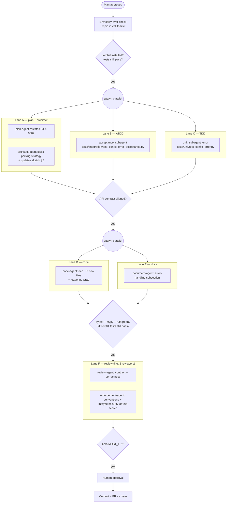

# BUILD-0002: Multiagent build plan for STY-0002

> **Lighter than BUILD-0001** — conventions, env-readiness shape, agent
> roster, branch-naming policy, and convention exceptions (G-1…G-9) were
> all settled by BUILD-0001 and remain in force. This plan only documents
> what's new or different for STY-0002.

---

## 0. Carry-over from BUILD-0001 (no re-litigation)

All of the following carry forward unchanged:

- **Branch naming:** CONTRIBUTING.md form (`feature/sty-0002-error-context`,
  already created).
- **`__init__.py` facade exception** (G-3): still applies; STY-0002 adds
  `ConfigError` to the public surface.
- **One-class-per-file** (G-4): still applies. New files added one class each.
- **Python floor 3.11** (G-8).
- **No StrictBool / Forbid model_config / alias scheme** decisions
  inherited; STY-0002 adds nothing to the schema models themselves.
- **Skip cargo-watch / E11** still appropriate (no Rust touch).
- **Convention enforcement set** unchanged.

---

## 1. What's new in STY-0002

| Item | Change | Owner |
|---|---|---|
| Runtime dep | Add `tomlkit>=0.13` to `[project].dependencies` | code-agent (TSK-001) |
| Public API | Add `ConfigError` to `hooksmith.config.__all__` | code-agent |
| New source file | `src/hooksmith/config/config_error.py` (`class ConfigError`) | code-agent |
| New source file | `src/hooksmith/config/_error_translator.py` (private helpers) | code-agent |
| Modified | `src/hooksmith/config/loader.py` — catch + translate + re-raise | code-agent |
| Modified | `src/hooksmith/config/__init__.py` — export `ConfigError` | code-agent |
| Modified | `docs/config/reference.md` — Error handling subsection | document-agent |
| Modified | `planning/build-plans/0001-architecture-sketch.md` §5 | architect-agent |
| New tests | `tests/unit/test_config_error.py` — ConfigError + translator | test-agent |
| Modified tests | `tests/unit/test_config_loader.py` — keep raw-exception tests, augment with `ConfigError.__cause__` assertions | test-agent |

---

## 2. Architect decision — parsing strategy

STY-0002 §Parsing strategy presents two options. Architect picks one in
Lane A2 and locks it in the architecture-sketch update (TSK-008):

- **Option A — always tomlkit:** simpler code, slightly slower happy path,
  one parse per load.
- **Option B — tomllib happy / tomlkit on error:** faster happy path, two
  parses on error.

Architect should run a quick micro-benchmark (single-call cost on repo's
`check.toml`) before committing. Both options are acceptance-compliant.

---

## 3. Execution map (delta vs BUILD-0001)

Same shape: env → A → (B + C parallel) → G1 → (D + E parallel) → G2 → F → G3.

Compressed because:

- Lane A is two agents (plan-agent restates STY-0002; architect updates §5 of
  the existing sketch). No second sketch document — the existing one gets a
  delta block.
- Lane C is one agent: `unit_subagent_error` (new tests) — no schema-tests
  fan-out (no schema changes).
- Lane B (ATDD) writes 4-5 acceptance tests in `tests/integration/`.
- Lane D is one agent: `code-agent` does the small impl (≈ 200 LOC across 3
  files + pyproject dep add).
- Lane E is one agent: `document-agent` updates the reference-doc error
  subsection. No fixture changes.
- Lane F is two reviewers (review-agent, enforcement-agent). Drop
  security-agent (no new trust boundary) and performance-agent (tomlkit
  cost characterized once in Lane A).



---

## 4. Subagent specs (delta only)

### Lane A1 — plan-agent
Same shape as BUILD-0001. Deliverable: `planning/build-plans/0002-charter.md`.

### Lane A2 — architect-agent
Deliverables (two files):
- `planning/build-plans/0002-architecture-decision.md` — picks parsing
  strategy (A or B), justifies with brief benchmark, specifies the
  `ConfigError` shape, the translator function signatures, the file-search
  algorithm for locating ValidationError positions.
- An in-place edit to `planning/build-plans/0001-architecture-sketch.md` §5
  adding the `ConfigError` row and noting that `__cause__` preserves the
  raw exception per two-layer test strategy.

### Lane B — acceptance_subagent
Deliverable: `tests/integration/test_config_error_acceptance.py` (4-5 tests
mirroring STY-0002 acceptance criteria).

### Lane C — unit_subagent_error
Deliverable: `tests/unit/test_config_error.py` (≥ 15 tests covering
`ConfigError` shape, both translator paths, multi-error case, edge cases).
Plus an in-place augmentation of `tests/unit/test_config_loader.py`'s
3 existing exception-type tests to add `assert isinstance(exc.__cause__, ...)`
side-by-side with `pytest.raises(ConfigError)`.

### Lane D — code-agent
Deliverables in dependency order:
1. `pyproject.toml`: add `tomlkit>=0.13` to `[project].dependencies`
2. `src/hooksmith/config/config_error.py`
3. `src/hooksmith/config/_error_translator.py`
4. Modify `src/hooksmith/config/loader.py`
5. Modify `src/hooksmith/config/__init__.py`

### Lane E — document-agent
Deliverable: in-place update to `docs/config/reference.md` "Error handling"
subsection.

### Lane F — review-agent
Verdict + findings per BUILD-0001 format.

### Lane F — enforcement-agent
Same 15-check sweep as BUILD-0001 plus:
- New checks: text-search code in `_error_translator.py` must not
  pass user-controlled input to `re.compile` without escaping (security
  consideration); no `eval` / `exec`; bounded loop iteration on multi-error
  cases.

---

## 5. Convention enforcement (delta)

Same checklist as BUILD-0001 plus:

- `pyproject.toml` change is the **only** new dep. enforcement-agent
  verifies via `diff` that only `tomlkit>=0.13` was added to `[project].dependencies`.
- `__init__.py` `__all__` list is updated; alphabetical or order-preserving
  is the architect's call but enforcement-agent verifies it matches the
  architect's sketch.
- New `private` module `_error_translator.py` starts with underscore; not
  exported from `__init__.py`.

---

## 6. Test strategy (delta)

- **Two-layer pattern** per user decision: every existing STY-0001 test
  asserting `pytest.raises(TOMLDecodeError)` or
  `pytest.raises(pydantic.ValidationError)` becomes:
  ```python
  with pytest.raises(ConfigError) as exc_info:
      load_config(...)
  assert isinstance(exc_info.value.__cause__, TOMLDecodeError)  # or ValidationError
  ```
  This locks both the wrapper layer (STY-0002) and the underlying raw
  identity (STY-0001) in one assertion.

- **New `test_config_error.py`** covers `ConfigError`'s constructors,
  `__str__` format, multi-error joining, and both translator branches
  (TOML-decode + validation) with at least one happy + one error case per
  branch.

---

## 7. Integration verification

Single boundary remains the same as STY-0001: local filesystem read of a
user-controlled `check.toml`. Verified by running:

- `python -c "from hooksmith.config import load_config; load_config(Path('check.toml'))"` — happy path still works
- `python -c "from hooksmith.config import load_config, ConfigError; ..." ` against fixtures that trigger each error class — produces `check.toml:LINE:COL: <message>` format

Both at G2.

---

## 8. Gap report

| # | Gap | Severity | Action |
|---|---|---|---|
| H-1 | Story §Parsing strategy leaves Option A vs B to architect. | DECISION | Architect picks in Lane A2 with bench data. Acceptable. |
| H-2 | tomlkit doesn't expose explicit lineno/colno — see story §5 update. Tests must verify the search-based approach is accurate. | KNOWN | Lane C tests must include "wrong key at line N" assertions with known line numbers in tmp_path fixtures. |
| H-3 | Multi-line ValidationErrors: pydantic reports them in document order; story implies one line per error. Need to verify pydantic's ordering is stable across versions. | LOW | Architect notes pydantic v2 behaviour in sketch; tests pin ordering via field choice rather than document order. |
| H-4 | `docs/config/reference.md` documents many fields the schema rejects (Lane E2 flagged in BUILD-0001). Not in scope to fix here — separate follow-up. | DEFERRED | Note in this build's "follow-ups" but do not block STY-0002 on it. |

---

## 9. Debug & retry

Same as BUILD-0001 §10.

---

## Approval

Pre-approved by virtue of:
- User accepted "Same multiagent pattern" for STY-0002
- User accepted "Add tomlkit for exact positions"
- User accepted "Keep both old + new tests — cover the raw and wrapped exceptions separately"

Lighter touch (no per-gate re-approval) since BUILD-0001 settled the
infrastructure. Orchestrator will pause and ask only if a MUST_FIX surfaces
at G3 or if a lane fails twice.
